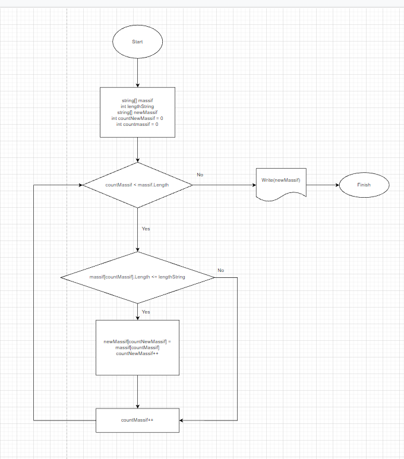

# HomeWork
## Georgvit

*Задача:* 

    Написать программу, которая из имеющегося массива строк формирует новый массив из строк, длина которых меньше, либо равна 3 символам. Первоначальный массив можно ввести с клавиатуры, либо задать на старте выполнения алгоритма. При решении не рекомендуется пользоваться коллекциями, лучше обойтись исключительно массивами.

*Решение*

    1. Создаем метод формирования строкового массива с присвоением каждому элементу строку введенную  пользователем.
    2. Созжаем метод отбирающий элементы удовлетворяющие условию и присваивающий их новому массиву.

*Блок схема метода создания нового массива*

